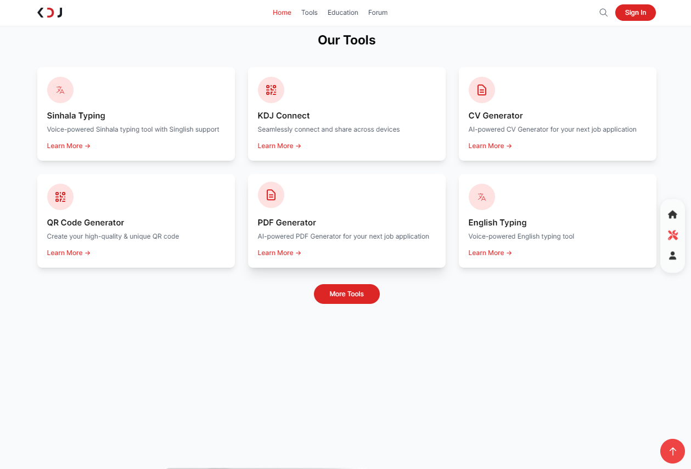
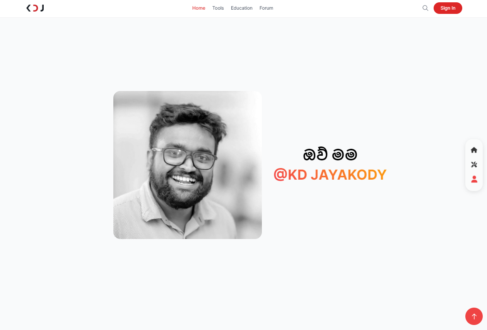
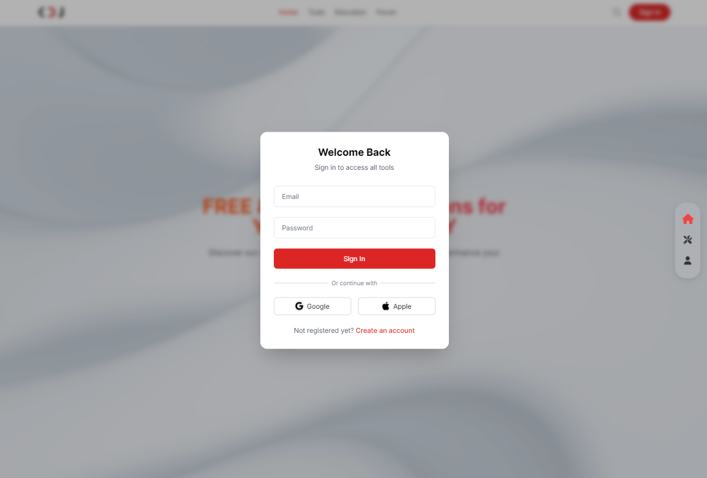
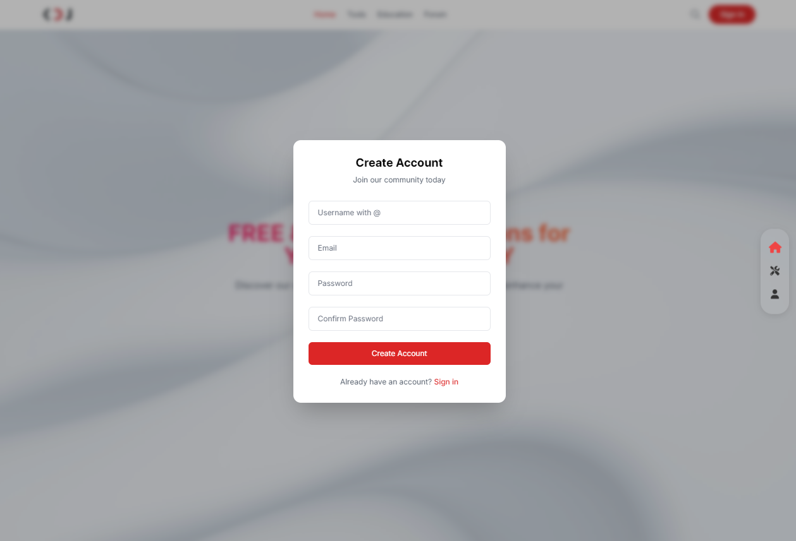
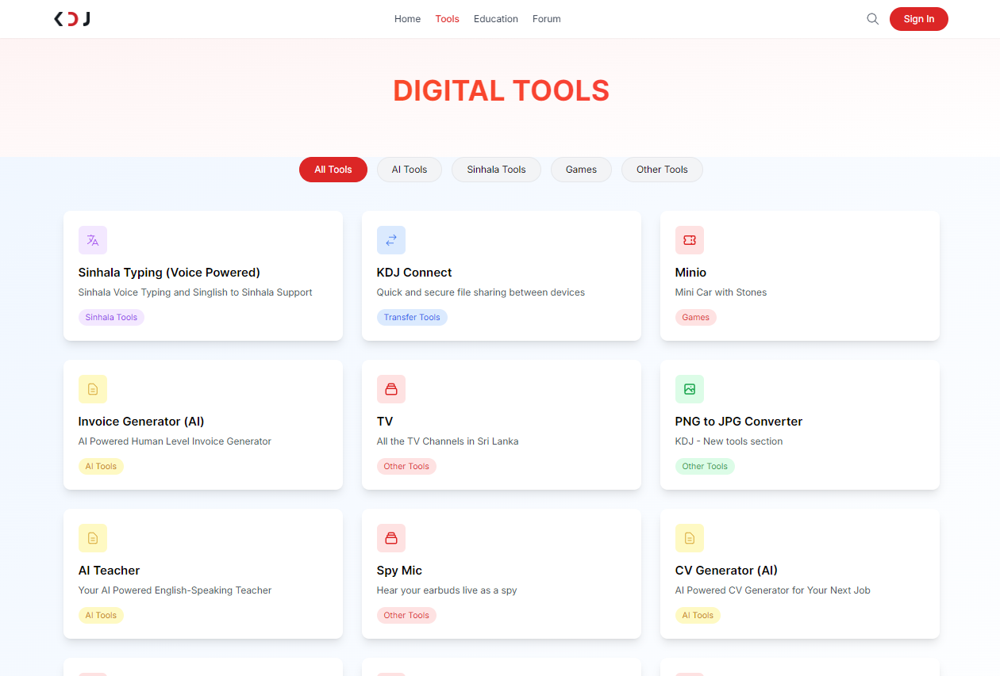
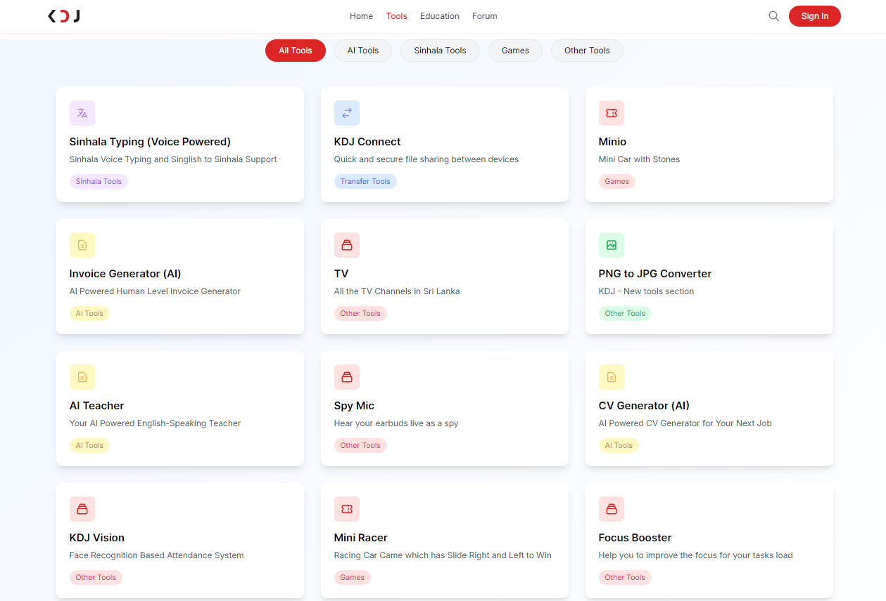
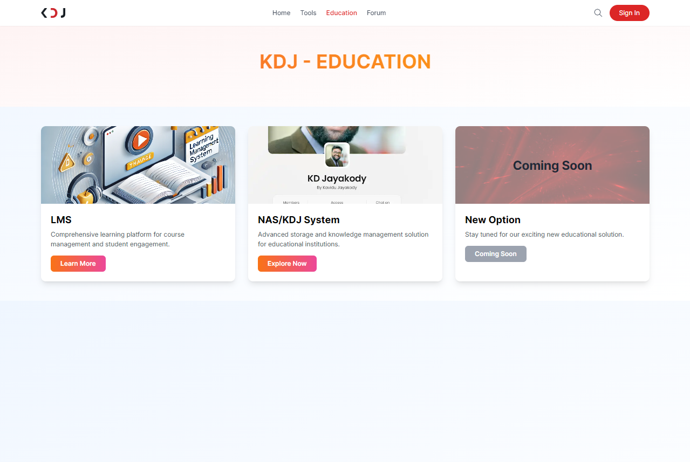
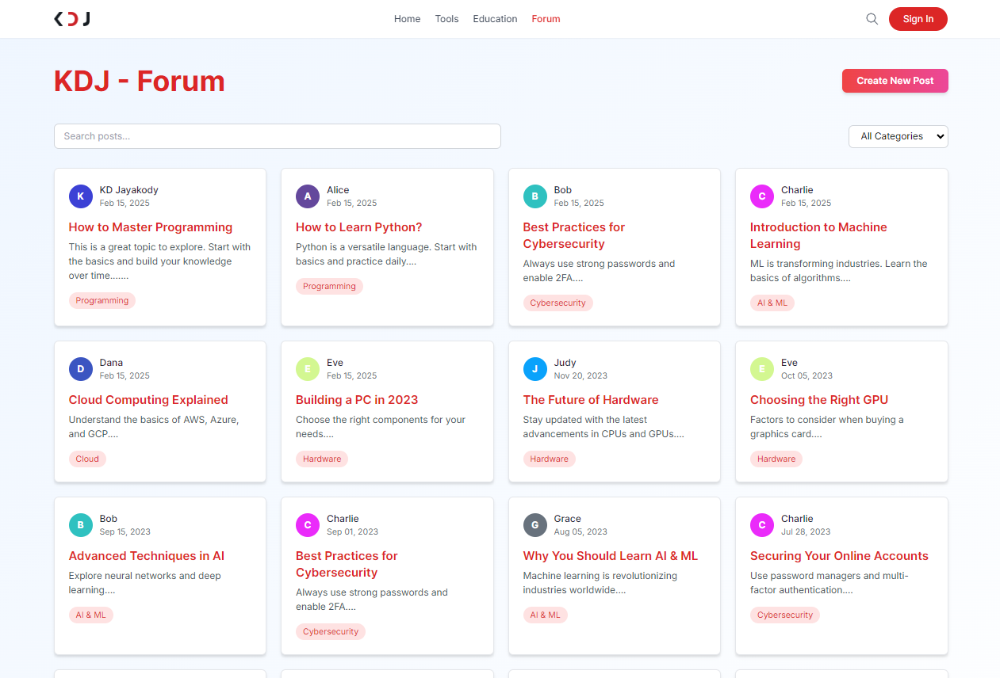
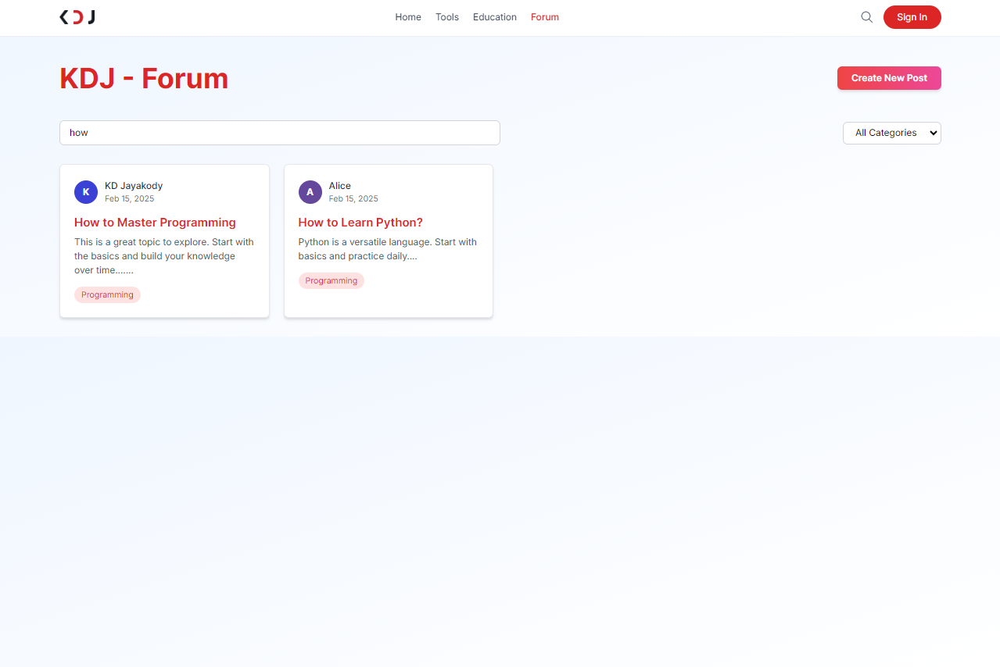
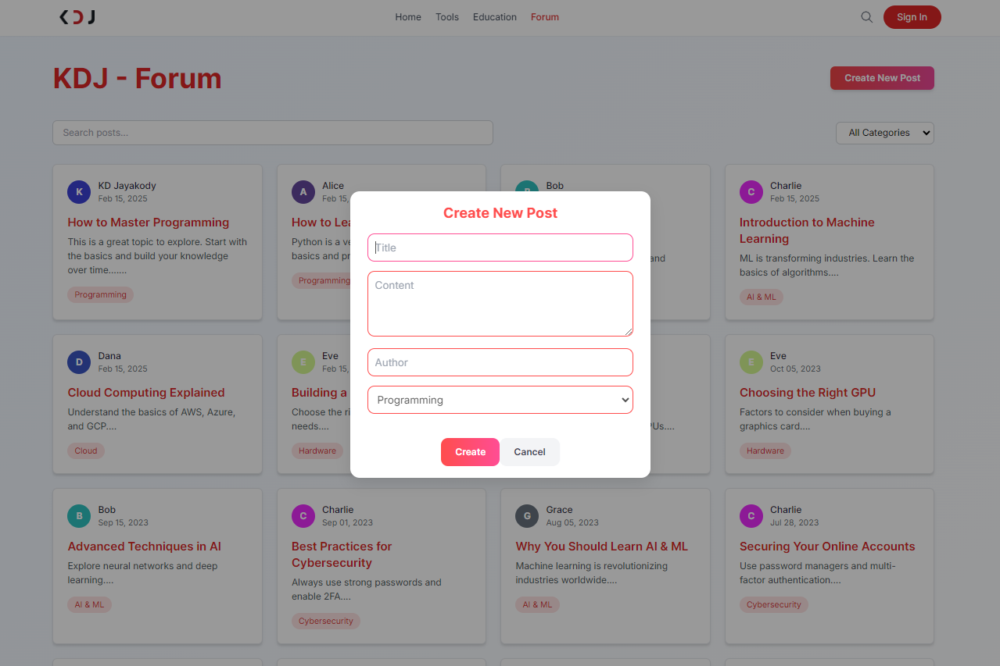

# KDJ Website

## Table of Contents
1. [Introduction](#introduction)
2. [Features](#features)
3. [Installation](#installation)
   - [Prerequisites](#prerequisites)
   - [Step-by-Step Installation](#step-by-step-installation)
4. [How to Run the Website](#how-to-run-the-website)
5. [Screenshots](#screenshots)
6. [Contributing](#contributing)
7. [License](#license)

---

## Introduction

The KDJ website is a dynamic web application built using **PHP** for server-side scripting and **phpMyAdmin** for database management. It is designed to provide an intuitive user experience with various features tailored to meet the needs of our clients. The website is hosted locally using **Laragon**, which provides a seamless environment for development and testing.

This README file will guide you through setting up the project locally, understanding its features, and running the website.

---

## Features

The KDJ website includes the following key features:

- **User Authentication**: Secure login and registration system for users.
- **Responsive Design**: Fully responsive layout optimized for desktops, tablets, and mobile devices.
- **Database Integration**: Utilizes MySQL via phpMyAdmin for storing user data, product information, and other relevant details.
- **Dynamic Content Management**: Admin panel to manage website content dynamically.
- **Contact Form**: Integrated contact form for users to reach out to the support team.
- **Search Functionality**: Advanced search feature to help users find specific content quickly.
- **SEO Optimization**: Search Engine Optimization techniques implemented for better visibility on search engines.

---

## Installation

### Prerequisites

Before installing the KDJ website, ensure you have the following installed on your machine:

- **Laragon**: A portable, isolated, fast, and powerful local development environment.
  - Download: [Laragon Official Website](https://laragon.org/)
- **PHP**: Ensure PHP is installed (comes bundled with Laragon).
- **phpMyAdmin**: For managing MySQL databases (also comes bundled with Laragon).
- **Git**: To clone the repository.
  - Download: [Git Official Website](https://git-scm.com/)

### Step-by-Step Installation

1. **Install Laragon**:
   - Download and install Laragon from the official website.
   - Launch Laragon and start the Apache and MySQL services.

2. **Clone the Repository**:
   - Open the terminal or command prompt.
   - Navigate to the `www` directory inside the Laragon installation folder.
     ```bash
     cd C:\laragon\www
     ```
   - Clone the KDJ website repository:
     ```bash
     git clone https://github.com/your-repo/kdj-website.git
     ```

3. **Set Up the Database**:
   - Open phpMyAdmin by clicking on the Laragon menu and selecting "phpMyAdmin".
   - Create a new database named `kdj_website`.
   - Import the SQL file provided in the repository (`database.sql`) into the newly created database.

4. **Configure the Environment**:
   - Navigate to the project directory:
     ```bash
     cd kdj-website
     ```
   - Locate the `.env` file (or create one if it doesn't exist) and configure the database connection settings:
     ```env
     DB_CONNECTION=mysql
     DB_HOST=127.0.0.1
     DB_PORT=3306
     DB_DATABASE=kdj_website
     DB_USERNAME=root
     DB_PASSWORD=
     ```

5. **Run the Application**:
   - In Laragon, right-click on the project folder (`kdj-website`) and select "Open URL" to launch the website in your default browser.

---

## How to Run the Website

Once the installation is complete, you can run the KDJ website by following these steps:

1. Start the Laragon services (Apache and MySQL).
2. Right-click on the `kdj-website` folder in Laragon and select "Open URL".
3. The website should open in your default web browser.

Alternatively, you can manually navigate to `http://localhost/kdj-website` in your browser.

---

## Screenshots

Below are some screenshots of the KDJ website:

### Homepage


### Homepage/tools


### Homepage/abot


### Login Page


### Register Page


### Digital Tools Page



###Education Page


### KDJ - Forum


### KDJ - Forum/search


### KDJ - Forum/create


*(Note: Replace the image paths with actual paths to your screenshots.)*

---

## Contributing

We welcome contributions to the KDJ website! If you'd like to contribute, please follow these steps:

1. Fork the repository.
2. Create a new branch (`git checkout -b feature/YourFeatureName`).
3. Commit your changes (`git commit -m 'Add some feature'`).
4. Push to the branch (`git push origin feature/YourFeatureName`).
5. Open a pull request.

Please ensure that your code follows the existing coding style and includes appropriate comments.

---

## License

This project is licensed under the MIT License - see the [LICENSE](LICENSE) file for details.

---

For any questions or issues, feel free to open an issue in the repository or contact the development team.

Happy coding! 🚀
